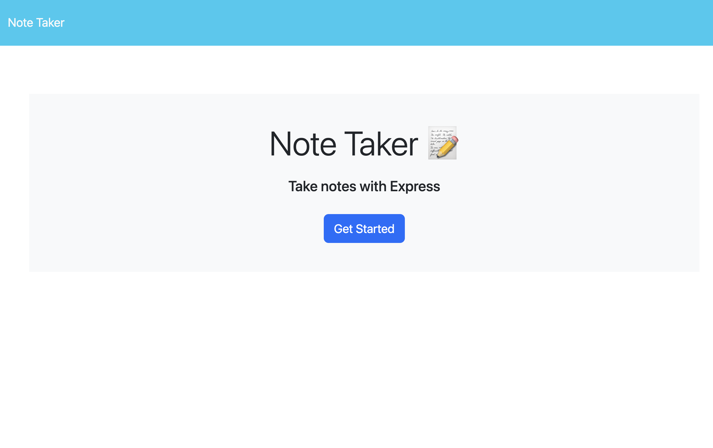

# Note Taker

## Description

- My motivation for tbuilding this project is learn how to build a note taker that I can use in my daily routine.

## Table of Contents

- [Installation](#installation)
- [Usage](#usage)
- [Credits](#credits)
- [How to Contribute and Questions](#how-to-contribute-and-questions)

## Installation

You have 2(two) options:

### Render it using the link below to access it online:

https://note-taker-express-js-j2ds.onrender.com

### Clone and run it in your local machine.

After cloning the code to your machine you should:

Have `node.js` installed to your machine.

Via `npm`

- `npm install` to install all dependecies/pachages for this application.
- `npm start` to run the application.
- Access the app using the localhost: Server is running on port http://localhost:3001

## Usage

After installing all node modules and start running the application, you should be able to:

### Access Home page👇👇👇

### Add and delete new notes page.

## Credits and Stack

Check `package.json` for more information about dependencies and packages used for this project.

## How to Contribute and Questions

if you want to contribute or have any questions, here are my channels:
gitHub: https://github.com/Alex-Design-For-Reap/note-taker-express-js

email: s.alexsilva@gmail.com

Author: Alex Da Silva (https://alex-design-for-reap.github.io/Portfolio/)
